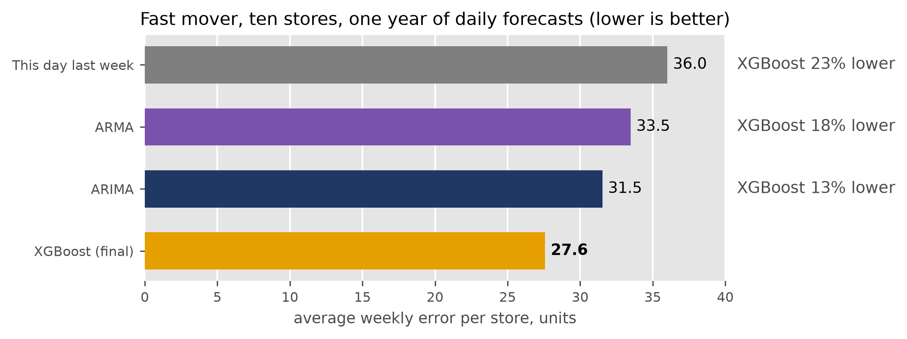

# Demand forecasting on M5

A daily, store-level demand forecast, tested over a full year at ten stores
against the forecasts an orderer might use without it. The data is the
public M5 dataset of Walmart daily sales, with a calendar of holidays and
SNAP benefit days.

**Report:** [`report/report.pdf`](report/report.pdf) has the full results.
[`report/brief.pdf`](report/brief.pdf) is the two-page summary.

## Results

On a fast, regular mover (14 to 103 units a day depending on the store),
XGBoost has the lowest error of the ten methods tested. It beats ARMA and
ARIMA at all ten stores.



| XGBoost (final) against | weekly error, units | RMSSE | weeks XGBoost won | stores XGBoost won |
|---|---|---|---|---|
| This day last week | 36.0 → 27.6 | 0.86 → 0.61 | 84% | 10 of 10 |
| ARMA | 33.5 → 27.6 | 0.70 → 0.61 | 69% | 10 of 10 |
| ARIMA | 31.5 → 27.6 | 0.65 → 0.61 | 58% | 10 of 10 |

ARMA has no seasonality and no holiday or SNAP inputs. ARIMA is seasonal,
with holiday and SNAP inputs, and is the strongest statistical model here.
Weekly error is the average absolute error on a week's total, in units.
RMSSE is the scaled error the M5 competition used (FPP §5.8), where 1.0 is
the error last week's number made on the training history and lower is
better. Weeks won is the share of the 3,580 seven-day forecasts (358
origins × 10 stores) where XGBoost's error was lower.

The final model is gradient-boosted trees (XGBoost) trained on all ten
stores at once, predicting each day's difference from the 28-day average.
On a slow, declining item (0.6 to 7 units a day) it ties a 28-day moving
average (0.50 each). Each series is classified by demand pattern before
fitting, and the rule for a wider catalogue is to give steady daily movers
the machine learning model and items that do not sell every day the simple
average.

## How it was tested

- Rolling-origin evaluation (FPP §5.10). One forecast origin per day of
  the test year (25 May 2015 to 22 May 2016), 358 per store. At each origin
  every model is refit on the history up to that day and forecasts the
  next seven days.
- Ten methods: two benchmarks, four statistical models and four machine
  learning variants.
- Bias (forecast minus actual) is reported beside error. A forecast that
  runs high is shrink every week, and one that runs low is a stockout.
- A validator has to pass before a number is quoted. It recomputes the
  benchmarks by formula, rebuilds the features a second way, and runs the
  pipeline on synthetic data with a known best score and on shuffled sales
  that no model should learn from.
- Reruns reproduce the same forecasts. Every run is recorded with its
  settings, code version and scores in a SQLite registry, which also loads
  into SQL Server ([`tools/sqlserver/`](tools/sqlserver/)).

The first study (one item, 52 weekly origins) is at tag `first-study`.

## Running it

```
python -m venv .venv                       # Python 3.14
source .venv/bin/activate
pip install -r requirements.txt
```

Put the Kaggle M5 files `sales_train_evaluation.csv`, `calendar.csv` and
`sell_prices.csv` in `data/` (gitignored). Then:

```
python -m src.validate                     # the checks above
python -m pytest tests                     # the test suite
python -m src.run --suite dev --item fast --methods xgboost_rel --note "first run"
```

The `dev` suite is three stores and eight weeks, under a minute.

### The SQL Server and IBM i loaders

Once per machine: IBM's ODBC driver (`ibm-iaccess`, from IBM's apt
repository, and `unixodbc`), the SQL Server container from
[`tools/sqlserver/docker-compose.yml`](tools/sqlserver/docker-compose.yml),
and the host settings in `~/.bashrc`:

```
export IBMI_HOST=pub400.com
export IBMI_USER=<IBM i user profile>
export IBMI_LIBRARY=<library for the FORECAST table>
```

The two passwords live in private files (`chmod 600`), never in
`~/.bashrc`, and are exported per terminal session. Every session, after a
reboot or not, the shell function below readies the terminal: it exports
both passwords, enters the project and its venv, starts the
`forecasting-sqlserver` container if it is stopped and waits until SQL
Server accepts connections. Put it in `~/.bashrc` and run `forecast-env`,
then the loaders in `tools/sqlserver/` and `tools/ibmi/` from that
terminal.

```bash
forecast-env() {
    local keys=~/Documents/keys f
    for f in .mssql_password.txt .ibmi_password.txt; do
        [ -r "$keys/$f" ] || { echo "forecast-env: missing $keys/$f" >&2; return 1; }
    done
    export MSSQL_PASSWORD="$(cat "$keys/.mssql_password.txt")"
    export IBMI_PASSWORD="$(cat "$keys/.ibmi_password.txt")"
    cd ~/Documents/projects/demand-forecasting || return 1
    source .venv/bin/activate

    local docker=docker
    docker info >/dev/null 2>&1 || docker="sudo docker"
    if [ "$($docker inspect -f '{{.State.Running}}' forecasting-sqlserver 2>/dev/null)" != true ]; then
        local since i ready=
        since=$(date +%s)
        $docker start forecasting-sqlserver >/dev/null || return 1
        printf 'Starting SQL Server'
        for i in $(seq 90); do
            if $docker logs --since "$since" forecasting-sqlserver 2>&1 | grep -q 'ready for client connections'; then
                ready=1
                break
            fi
            printf '.'
            sleep 1
        done
        [ -n "$ready" ] && echo ' ready.' || echo ' not ready after 90s; check: docker logs forecasting-sqlserver' >&2
    fi
    echo "Ready: $IBMI_USER@$IBMI_HOST library $IBMI_LIBRARY; SQL Server on localhost:1433; venv active."
}
```

On PUB400 the ODBC connection needs `ExtendedDynamic=0`, which
`tools/ibmi/load_forecasts.py` sets: by default the driver keeps an SQL
package in `QGPL`, where PUB400 allows no objects.

## Layout

```
src/          data loading, features, models, evaluation, registry, validator
src/models/   one module per forecaster
notebooks/    exploration, evaluation and ordering, as percent-format scripts
tests/        pytest suite
tools/        refit, comparison, figure, report and SQL Server scripts
tools/ibmi/   the push of forecasts to DB2 on an IBM i host, and its DDL; the
              host side is github.com/wesGates/forecast-host-ports
report/       the report and the brief (PDF)
```

## Limits

M5 has no inventory, deliveries or stockouts, so an order can only be
simulated, and a zero on the shelf cannot be told from a zero in demand.
Two items at ten stores is a small study. New items with no history are
not addressed.

## References

FPP: Hyndman, R. J., Athanasopoulos, G., Garza, A., Challu, C., Mergenthaler,
M., and Olivares, K. G. (2026). *Forecasting: Principles and Practice, the
Pythonic Way*. OTexts. [otexts.com/fpppy](https://otexts.com/fpppy).

Makridakis, S., Spiliotis, E., and Assimakopoulos, V. (2022). M5 accuracy
competition: Results, findings, and conclusions. *International Journal of
Forecasting*, 38(4), 1346–1364.
